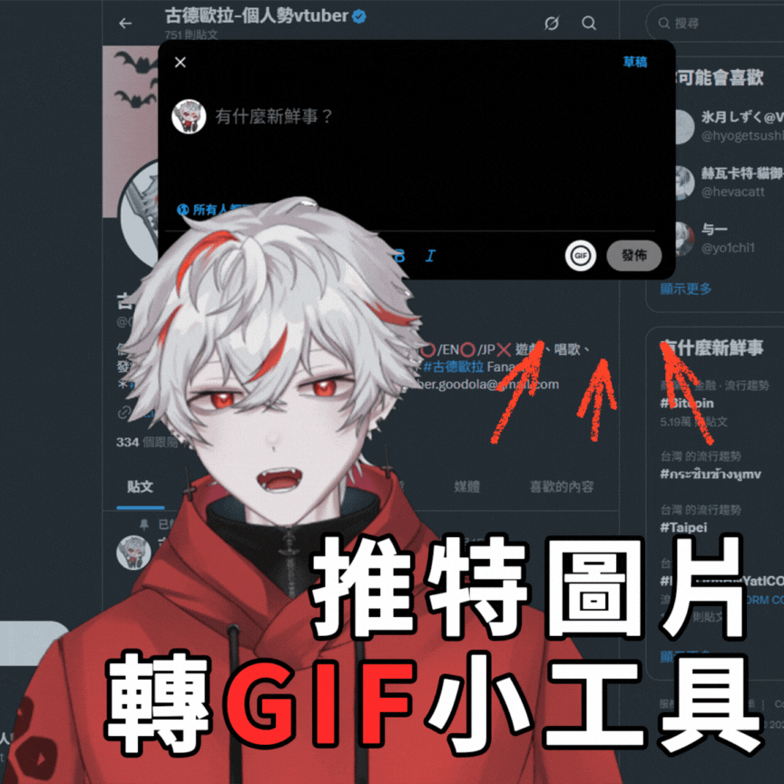

# Img2GifChromePlugin

[English](#english) | [繁體中文](#繁體中文) | [日本語](#日本語)

---

## English

Convert images to GIF directly from X (Twitter) and upload them instantly to your post.

Think of it as:
- **No external websites** - Don't want to upload your images to third-party sites
- **One-click conversion** - Just click the GIF button in the X compose window to convert and upload

(Vampire tip: We only consume your CPU, not your data 🧛)

---

### Features

- **One-click image selection**: Adds a GIF button next to the "Post" button in X's compose window
- **Supported formats**: `JPG` / `PNG` / `WEBP` / `GIF`
- **No data transfer**: Converts directly and uploads to X (simulates file selection)
- **Local processing**: All conversion happens in your browser, no third-party servers involved

### System Requirements

- Google Chrome (or Chromium-based browsers)
- Currently supports:
  - `https://x.com/*`
  - `https://twitter.com/*`

### Installation (Developer Mode / Load unpacked)

> This is the most common installation method for extensions not yet on Chrome Web Store.

1. Download and extract the zip file from [releases](https://github.com/GoodOla/Img2GifChromePlugin/releases)

2. Open Chrome and go to:
   - `chrome://extensions/`

3. Enable **Developer mode** in the top right corner
   - 

4. Click **Load unpacked**
   - 

5. Select this project folder
   - 

6. After loading, refresh `https://x.com` (press F5)

### Usage

1. Open `https://x.com` or `https://twitter.com`
2. Click "Post" to open the compose window
3. You'll see a GIF icon button next to the "Post" button
4. Click the GIF button → Select image(s) to convert (multi-select supported)
5. Wait a moment, the converted GIF will automatically upload to your media section

#### Tips

- Converting GIF may consume CPU (especially for large images). Consider resizing images first for faster conversion
- When selecting multiple images, they will be processed and uploaded sequentially

### Troubleshooting

**1) Can't see the GIF button**
- Make sure you're on `x.com` / `twitter.com`
- Go to `chrome://extensions/`
  - Confirm the extension is enabled
  - Click **Reload**
- Return to X and press **F5**

**2) Button doesn't respond / No upload**
- Open DevTools Console to check for error messages
- X's DOM changes frequently; if the button position changes, the selector may need updating

**3) Converted image is not showing as GIF**
- This project uses `gif.js` to generate real GIF files locally
- If X doesn't show the GIF label, it might be because there's only 1 frame
  - This project uses **2 identical frames** to increase the chance of showing the GIF label

**4) `Failed to construct 'Worker'` / Worker errors**
- This project uses `blob:` method to load `gif.worker.js` to avoid CORS issues
- If still failing:
  - Reload the extension
  - Refresh X with F5

### Privacy & Data Usage

- This extension **does NOT** upload your images to any third-party servers
- Image to GIF conversion happens entirely in your browser
- The final GIF is only uploaded to X/Twitter (just like manually uploading a file)

### Project Structure

- `manifest.json`: MV3 configuration, only injects on `x.com/twitter.com`
- `content.js`:
  - Injects GIF button
  - Image selection → Canvas drawing → `gif.js` generates GIF → Triggers X's `fileInput` upload
- `vendor/gif.js`, `vendor/gif.worker.js`: GIF encoding libraries (bundled locally to avoid CSP issues)

### Contributing / Development

Pull requests and issues are welcome.

Suggested testing process:

1. Reload extension at `chrome://extensions/`
2. Refresh `x.com` with F5
3. Open compose window and test button and upload

---

## 繁體中文

在 X（Twitter）發文時，把你選的圖片 **即時轉成 GIF** 並**直接丟回發文視窗**上傳。

你可以把它想成：

- **不想把圖丟去外部網站轉檔**（怕被 AI 亂咬一口）
- 只想在 X 發文框裡「點一下」就把圖片變 GIF 上傳

（宅宅吸血鬼小提醒：我們只吸你電腦的效能，不吸你的資料 🧛）

---

### 功能特色

- **一鍵選圖**：在 X 發文視窗的「發佈」按鈕旁邊加一個 GIF 按鈕
- **支援格式**：`JPG` / `PNG` / `WEBP` / `GIF`
- **不落地、不下載**：轉完直接塞進 X 的上傳框（模擬選檔）
- **本機端處理**：轉檔在瀏覽器內完成，不會上傳到任何第三方伺服器

### 系統需求

- Google Chrome（或 Chromium 系）
- 目前僅支援：
  - `https://x.com/*`
  - `https://twitter.com/*`

### 安裝方式（開發者模式載入 / Load unpacked）

> 這是「未上架 Chrome Web Store」時最常用的安裝方式。

1. 下載壓縮檔並且解壓縮 [下載地址](https://github.com/GoodOla/Img2GifChromePlugin/releases)

2. 在 Chrome 的網址列輸入下面連結
   - `chrome://extensions/`

3. 右上角打開：
   - **Developer mode / 開發人員模式**
   - 

4. 點擊：
   - **Load unpacked / 載入未封裝項目**
   - 

5. 選擇這個專案的資料夾
   - 

6. 載入成功後，到 `https://x.com` 重新整理頁面（F5）

### 使用方式

1. 打開 `https://x.com` 或 `https://twitter.com`
2. 點「發文」打開發文視窗（Compose）
3. 在「發佈」按鈕旁邊，你會看到一個 GIF 圖示按鈕
4. 點 GIF 按鈕 → 選擇你要轉的圖片（可多選）
5. 稍等一下，轉好的 GIF 會自動「上傳進發文視窗」的媒體區

#### 小提示

- 轉 GIF 可能會吃 CPU（尤其是大圖），建議先用圖片工具縮小解析度會更快
- 一次多選多張時，會依序處理並上傳

### 常見問題（Troubleshooting）

**1) 看不到 GIF 按鈕**

- 確認你是在 `x.com` / `twitter.com`
- 到 `chrome://extensions/`
  - 確認擴充功能已啟用
  - 點 **重新整理**（reload）
- 回到 X 頁面按 **F5**

**2) 點了按鈕沒反應 / 沒有上傳**

- 打開 DevTools Console 看是否有錯誤訊息
- X 的 DOM 常改版，如果按鈕位置被換掉，可能需要更新 selector

**3) 轉出來不是 GIF（X 沒顯示 GIF 標籤）**

- 本專案使用 `gif.js` 在本機產生真正 GIF（二進位），理論上會是 GIF
- 如果你看到仍然被當成靜態圖，可能是 X 對某些情境不顯示標籤（例如只 1 frame）
  - 本專案用 **2 個相同 frame** 提高顯示 GIF 標籤機率

**4) `Failed to construct 'Worker'` / Worker 相關錯誤**

- 本專案已用 `blob:` 方式載入 `gif.worker.js` 來避免跨來源限制
- 若仍出錯：
  - 先 reload extension
  - 再 F5 重新整理 X 頁面

### 隱私與資料使用（Privacy）

- 本擴充功能**不會**把你的圖片上傳到任何第三方伺服器
- 圖片轉 GIF 在瀏覽器內完成
- 最終只會把轉好的 GIF **上傳到你正在發文的 X/Twitter**（就像你自己手動選檔上傳一樣）

### 專案結構（簡述）

- `manifest.json`：MV3 設定，限定只在 `x.com/twitter.com` 注入
- `content.js`：
  - 注入 GIF 按鈕
  - 選圖 → Canvas 繪製 → `gif.js` 產 GIF → 觸發 X 的 `fileInput` 上傳
- `vendor/gif.js`、`vendor/gif.worker.js`：GIF 編碼用（本地打包，避開 CSP）

### 貢獻 / 開發

歡迎 PR / Issue。

建議測試流程：

1. `chrome://extensions/` reload 擴充功能
2. `x.com` F5
3. 打開發文視窗測按鈕與上傳

---

## 日本語

X（Twitter）で投稿する際に、選択した画像を **リアルタイムで GIF に変換** して、**投稿ウィンドウに直接アップロード** します。

以下のような場合に便利です：

- **外部サイトに画像をアップロードしたくない**（AI に無断で使用されるのを避けたい）
- **X の投稿ボックスで「ワンクリック」するだけで画像を GIF に変換してアップロードしたい**

（吸血鬼からのヒント：あなたのデータではなく、あなたの CPU だけを吸収します 🧛）

---

### 機能

- **ワンクリック画像選択**：X の投稿ウィンドウの「投稿」ボタンの横に GIF ボタンを追加
- **対応形式**：`JPG` / `PNG` / `WEBP` / `GIF`
- **ローカル処理**：変換後、X のアップロードボックスに直接挿入（ファイル選択をシミュレート）
- **ブラウザ内処理**：すべての変換がブラウザ内で完了し、第三者のサーバーにはアップロードされません

### システム要件

- Google Chrome（または Chromium ベースのブラウザ）
- 現在対応しているサイト：
  - `https://x.com/*`
  - `https://twitter.com/*`

### インストール方法（開発者モード / Load unpacked）

> これは Chrome Web Store にまだ登録されていない拡張機能の最も一般的なインストール方法です。

1. [リリースページ](https://github.com/GoodOla/Img2GifChromePlugin/releases)から zip ファイルをダウンロードして解凍します

2. Chrome のアドレスバーに以下を入力します：
   - `chrome://extensions/`

3. 右上の **Developer mode / 開発者モード** を有効にします
   - 

4. **Load unpacked / 拡張機能を読み込む** をクリックします
   - 

5. このプロジェクトフォルダを選択します
   - 

6. 読み込み完了後、`https://x.com` をリロードします（F5 キー）

### 使用方法

1. `https://x.com` または `https://twitter.com` を開きます
2. 「投稿」をクリックして投稿ウィンドウを開きます
3. 「投稿」ボタンの横に GIF アイコンボタンが表示されます
4. GIF ボタンをクリック → 変換する画像を選択します（複数選択可能）
5. しばらく待つと、変換された GIF がメディアセクションに自動的にアップロードされます

#### ヒント

- GIF 変換は CPU を消費する場合があります（特に大きな画像）。事前に画像ツールで解像度を下げることをお勧めします
- 複数の画像を選択した場合、順番に処理されてアップロードされます

### トラブルシューティング

**1) GIF ボタンが表示されない**

- `x.com` / `twitter.com` にアクセスしていることを確認してください
- `chrome://extensions/` に移動します
  - 拡張機能が有効になっていることを確認します
  - **再読み込み** をクリックします
- X ページに戻って **F5** キーを押します

**2) ボタンをクリックしても反応がない / アップロードされない**

- DevTools コンソールを開いてエラーメッセージを確認します
- X の DOM は頻繁に変更されるため、ボタンの位置が変わった場合は、セレクタを更新する必要があります

**3) 変換された画像が GIF ではない（X が GIF ラベルを表示しない）**

- このプロジェクトは `gif.js` を使用してローカルで実際の GIF ファイルを生成します
- X が GIF ラベルを表示しない場合は、フレームが 1 つだけの場合など、特定の状況が原因の可能性があります
  - このプロジェクトは **2 つの同一フレーム** を使用して、GIF ラベルが表示される可能性を高めています

**4) `Failed to construct 'Worker'` / Worker 関連のエラー**

- このプロジェクトは `blob:` メソッドを使用して `gif.worker.js` を読み込み、CORS の問題を回避しています
- それでもエラーが発生する場合：
  - 拡張機能をリロードします
  - X ページを F5 でリロードします

### プライバシーとデータ使用

- この拡張機能は、あなたの画像を第三者のサーバーにアップロード **しません**
- 画像から GIF への変換はブラウザ内で完全に行われます
- 最終的な GIF は、投稿している X/Twitter にのみアップロードされます（手動でファイルをアップロードするのと同じです）

### プロジェクト構造

- `manifest.json`：MV3 設定、`x.com/twitter.com` にのみ注入
- `content.js`：
  - GIF ボタンを注入
  - 画像選択 → Canvas 描画 → `gif.js` が GIF を生成 → X の `fileInput` アップロードをトリガー
- `vendor/gif.js`、`vendor/gif.worker.js`：GIF エンコーディング用（CSP の問題を回避するためローカルにバンドル）

### 貢獻 / 開発

プルリクエストと Issue を歓迎します。

推奨テストプロセス：

1. `chrome://extensions/` で拡張機能をリロード
2. `x.com` を F5 でリロード
3. 投稿ウィンドウを開いてボタンとアップロードをテスト

